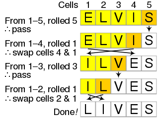

# 03 JavaScript Password Generator

## Description

The purpose of this generator is to allow the user to specify criteria for a password while still being useful as a password. The primary goals were that the user input should be easy to give, the output should be easy to read, and that the internal mechanism did more or less what the user is led to expect: random-ish generation with a minimum of repeating (more often than chance) or predictable features.

Humans are very bad at selecting random anything - they're even bad at recognizing randomness when they see it - so password generators are a very important tool for creating keys that aren't easily reconstructable if you know what they're based off. A bad password is based on your birthday, your dog's name, or your favorite musician. A good password, you might say, is based off as little as possible.

### Challenges

Obviously, though, a password based on nothing would not be very user friendly. In practice, a user needs to be able to specify SOME things about the password they need (based on the requirements of whatever system they're creating it for, if nothing else), so much agonizing was done in how to keep things "random enough" while still nudging the result in the right direction.

Easy enough to take whatever characters the user selects and enter them into a Math.random() lottery and draw lucky winners from this new array of options, but of course, this only means that, if Special Characters are selected, that ! and ? are nominated for inclusion in the password, not that they or any special character will actually make the cut.

I considered simply running and check and redoing the whole generative process until it passes all the necessary checks, but that seemed inelegant. The project number of retries isn't that bad for most configurations of the current checkboxes, but things get complicated quickly if for future functionality: if an upgraded app lets the user opt to include spaces, that system would require a lot of do overs until the array with a population of one is represented.

My next thought was artificially inserting the missing characters: if there should be numbers and there aren't, grab a random numeric character and splice it in at a random spot in the password, overwriting one to maintain desired length. But that still requires either do-overs or checks after the fact: your random number might choose to rewrite the only capital letter, and now you pass the number test but fail another.

I'm new to programming but have a little experience as an amateur statistician as it relates to game theory, choice arrays, and random selection, so it was about the time that I began seriously considering doing math to check which option was more likely to do unnecessary work that I had the head-slapping moment.

### The Fisher-Yates Shuffle

You want to randomly select every character if possible. If you must force a character of a new type in, you want to choose one character of that type randomly, and choose its new position randomly as well. Or, you could simply do what it took me way too long to do, and insert a random character of the desired type as soon as it's selected, and then use the "lottery" method to fill in the rest only after at least one from each desired category is in. This should require no checks or do-overs, provided we can figure out a reliable way to shuffle the results (so that every password generated does not begin with lowercase, uppercase, numeral, special). That doesn't sound so hard.

The easiest reliable and fair method that I definitely knew how to do in Javascript was to take indexes at random from the unshuffled array, remove them, and push them onto the end of the new shuffled array (random draw without replacement). My code to do this got much more elegant once I remembered the name for this method: a Fisher-Yates shuffle. I didn't have to count on the "black-box" of some of the methods using .sort() that I had researched, because the mechanism was understandably random: put the options in a hat, draw and stack until the hat is empty:

## Future Developments

Including what we want and then shuffling rather than hoping for the best and then checking our luck should actually make it easier to add new categories or subcategories. For example, not all special characters are made equal in the eyes of some websites - I've already mentioned that currently spaces are assumed to not be desirable inclusions, but it would be easy to give the user that option, now.

I also would, with more time, be able to clean up the Javascript considerably by making more use of variables. I could also make the interface a little more foolproof by created error messages if no selections had been made or no length had been specified.

## Credits

Thanks to Ronald Fisher and Frank Yates for codifying an algorithmic sort that stuck with me